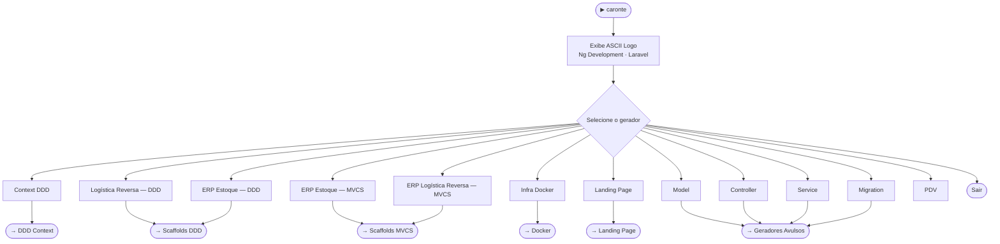
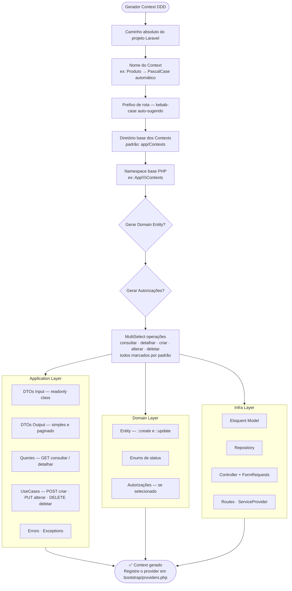
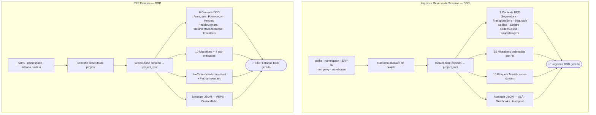
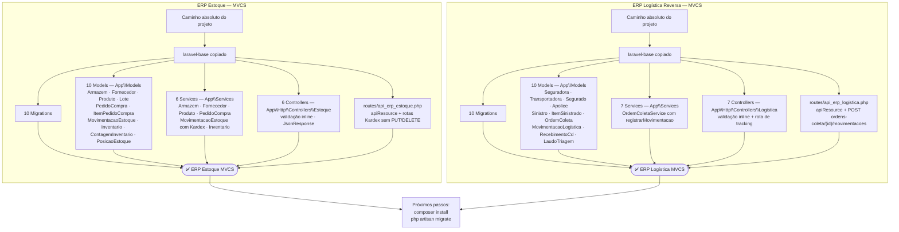

# caronte-laravel

> **Gerador interativo de código Laravel com suporte a DDD, Clean Architecture e infraestrutura Docker.**  
> Escrito em Rust — roda via terminal e via painel gráfico (Tauri). Sem dependências externas.

```
##########################################################################
##########################################################################
##########################################################################
#################################################################****#####
###############################################################*=:..:+*###
##############################################################*-.    .+###
##############################################################*:      -###
##############################################################*-     .+###
##############################################################*: ...:=####
#####################*****###**+++**##############**+++***###*: -***######
####################=.....+*=:.    .-+*########*+-.     .-+*+:.-##########
##############*=-*##=     -.         .=#######+:          .:..=#+#########
############*=. :*##+                  =#####=.       ..    .=#-.*########
##########*-.   :*##+       :=++-.     .*###=     .-+***+:..+*- .*########
########+-.   .=*###+      =#%%%%*:    .+##*.    .+#%%%%%#=+*-  .*########
######+:    :=#%####+     :#####%%=     =##+.    =#%###%%%#*:   .*########
#####+.. .:+#%######+     -#######+     =##=    .*#########+    .*########
#####+...:*#########+.   .=#######+     =##=.   .*#########=    .*########
#####*:....-+#######+.  ..-#######+.    =##+.   .+#########:.   .*########
#######+:....:=*####+.....=#######+.....=###: ..=*+*#####*-......*########
######%%#*-....:=###+.....=#######+.....=##%+..+*-.:-=+=-.......:*########
########%%#*=...:###+.....=#######+.....=##%%+**-...............:*########
##########%%%#=::###+.....=#######+.....=#####*:..........--....:*########
###########%%%%#*###+.....=#######+.....=####*:.-+-:::::=*#=....:*########
##############%%%###*=----+#######*--=--*###+:.=#%######%##:....:#%%###%##
####################%%%%%%%######%%%%%#####+::=#*###%#####=:..:.=#%%%%%%%%
#####################%%%%%########%#######=.:+*-:-=+****+-:.::::#%%%%%%%%%
#####################################*=-:-::+#-::::::::::::::::*%%%%%%%%%%
####################################+::::::-#*-::::::::::::::-*%%%#%#%####
####################################-:::::::*##*+=-:::::::-+*%%%%%#%%%####
####################################=:::::::*%%%%%########%%%%%%%%#%%%####
####################################*-:::::+#%%%%%%%%%%%%%%%%%%%%%#%%%####
###################################%%#*+=+*#%%##%%%%%%%%%%%%%%%%%%%%%%####
###################################%%%%%%%%#######%%%%%%%%%#%%%%%%#%%%=###
####################################%%%%%%%%###%%%%%%###%%%#%%%%%%##%%+###
#####################################%%##%#####%##%%#%%#%%###%%##%#%%%%%%%
#########################################%####%%%%%%%%%%%%%%%%%%%%%%%%%%%%
########################################%%##########%%%%%%%%%%%#%%#%%%%%%%
######################################%%#######%#%#%%#%%%%%%%%%%%%%%%%%%%%
#######################################%%%%#%#%%%%%%%%%####%%%%%%%%%%%%%%%
#############%%%###################%##%%%%##%#%%%%%%%%%###%%#%%%%%%%%%#%%%
```
---

## Sumário

- [Visão Geral](#visão-geral)
- [Estrutura do Projeto](#estrutura-do-projeto)
- [Menu Principal](#menu-principal)
- [Fluxo — Context DDD](#fluxo--context-ddd)
- [Fluxo — Scaffolds DDD Completos](#fluxo--scaffolds-ddd-completos)
- [Fluxo — Scaffolds MVCS](#fluxo--scaffolds-mvcs-padrão-laravel)
- [Fluxo — Infra Docker](#fluxo--infra-docker)
- [Fluxo — Landing Page](#fluxo--landing-page)
- [Fluxo — Geradores Avulsos (MVCS)](#fluxo--geradores-avulsos-mvcs)
- [Geradores em Detalhe](#geradores-em-detalhe)
- [Painel Gráfico — caronte Manager](#painel-gráfico--caronte-manager-tauri)
- [Instalação](#instalação-e-uso)
- [Changelog](#changelog)
- [Licença](#licença)

---

## Visão Geral

O `caronte` gera scaffolding completo para projetos Laravel. Suporta dois padrões arquiteturais:

- **DDD + Clean Architecture** — Bounded Contexts com Application / Domain / Infra layers
- **MVCS** — padrão nativo Laravel (`App\Models` · `App\Services` · `App\Http\Controllers`)

Cada gerador faz perguntas interativas e salva os arquivos no **caminho absoluto informado pelo usuário** — nunca dentro do próprio projeto `caronte`.

| Modo | Como rodar |
|---|---|
| **CLI interativo** | `caronte` no terminal |
| **Painel desktop** | `tauri dev` (dev) ou binário `caronte-manager` (prod) |

**13 geradores disponíveis:**

| # | Gerador | Padrão | O que entrega |
|---|---|---|---|
| 1 | Context DDD | DDD | Bounded context completo (Application + Domain + Infra) |
| 2 | Logística Reversa de Sinistros | DDD | 7 Contexts + 10 Migrations + 10 Models + Manager JSON |
| 3 | ERP Estoque | DDD | 6 Contexts + Kardex + UseCases + Manager JSON |
| 4 | **ERP Estoque** | **MVCS** | Models + Services + Controllers + Migrations + Routes |
| 5 | **ERP Logística Reversa** | **MVCS** | Models + Services + Controllers + Migrations + Routes |
| 6 | Infra Docker | — | Dockerfile dev/prod + compose + Nginx + Makefile |
| 7 | Landing Page | — | HTML + Tailwind + DaisyUI (generic ou SaaS) |
| 8 | Model | MVCS | Eloquent Model + Migration + Service + Controller opcionais |
| 9 | Controller | MVCS | Resource com injeção de Service ou plain |
| 10 | Service | MVCS | Service com CRUD delegando ao Model |
| 11 | Migration | — | Schema::create com timestamp Laravel correto |
| 12 | PDV | — | Scaffold Ponto de Venda |

---

## Estrutura do Projeto

```
caronte-laravel/
├── src/
│   ├── main.rs                     ← CLI: menu interativo + ASCII logo
│   ├── cli.rs                      ← Structs de args compartilhados
│   └── flows/
│       ├── deps.rs                 ← copy_laravel_base + verify_all
│       ├── context/                ← Gerador Context DDD
│       ├── docker/                 ← Gerador Infra Docker
│       ├── estoque/                ← Scaffold ERP Estoque (DDD)
│       ├── erp_estoque/            ← Scaffold ERP Estoque (MVCS)
│       ├── erp_logistica/          ← Scaffold ERP Logística Reversa (MVCS)
│       ├── logistica_reversa/      ← Scaffold Logística Reversa (DDD)
│       ├── landing_page/           ← Gerador Landing Page (generic + saas)
│       ├── pdv/                    ← Scaffold PDV
│       └── artesanal/
│           ├── controller/         ← Gerador Controller (+ Service opcional)
│           ├── model/              ← Gerador Model (+ Service + Controller opcionais)
│           ├── service/            ← Gerador Service
│           └── migration/          ← Gerador Migration (timestamp Laravel real)
├── laravel-base/                   ← Template Laravel 13 (sem vendor/)
│   ├── app/ · bootstrap/ · config/ · database/ · routes/ · resources/
│   └── composer.json               ← laravel/framework ^13.x
├── manager/                        ← Crate Tauri (painel desktop)
│   ├── src/
│   │   ├── lib.rs                  ← Tauri app builder
│   │   └── commands.rs             ← Bridge frontend → geradores Rust
│   └── tauri.conf.json
├── frontend-installer/             ← SPA Vite + TypeScript + Tailwind + DaisyUI
│   ├── index.html                  ← Layout drawer (sidebar + main)
│   └── src/main.ts                 ← Páginas e handlers dos geradores
├── Cargo.toml                      ← Workspace (caronte-laravel + manager)
├── install.sh                      ← Instala caronte em /usr/local/bin
└── install.ps1                     ← Instala caronte em %USERPROFILE%\.cargo\bin
```

---

## Menu Principal



---

## Fluxo — Context DDD



---

## Fluxo — Scaffolds DDD Completos



---

## Fluxo — Scaffolds MVCS (padrão Laravel)



---

## Fluxo — Infra Docker


---

## Fluxo — Landing Page


---

## Fluxo — Geradores Avulsos (MVCS)

```mermaid
flowchart TD
    subgraph MOD [Model]
        M0[Caminho do projeto] --> M1[Nome — ex: Produto]
        M1 --> M2{+ Migration?}
        M2 --> M3{+ Service — MVCS?}
        M3 --> M4{+ Controller?}
        M4 --> MA[app/Models/Produto.php]
        M4 --> MB[database/migrations/YYYY_MM_DD_HHMMSS_create_produtos_table.php]
        M4 --> MS[app/Services/ProdutoService.php\nindex · show · store · update · destroy]
        M4 --> MC[app/Http/Controllers/ProdutoController.php\ninjeta ProdutoService no construtor]
        MA & MB & MS & MC --> MOK([✅ Model gerado])
    end

    subgraph CTRL [Controller]
        C0[Caminho do projeto] --> C1[Nome — ex: ProdutoController]
        C1 --> C2{Gerar Service junto — MVCS?}
        C2 -- sim --> CS[app/Services/ProdutoService.php\n+ Controller com injeção]
        C2 -- não --> CA[Controller resource padrão Laravel]
        CS & CA --> COK([✅ Controller gerado])
    end

    subgraph SVC [Service]
        S0[Caminho do projeto] --> S1[Nome — ex: Produto]
        S1 --> S2[Model a injetar\nauto: mesmo nome]
        S2 --> SA[app/Services/ProdutoService.php]
        SA --> SOK([✅ Service gerado])
    end

    subgraph MIG [Migration]
        G0[Caminho do projeto] --> G1[Nome — ex: create_produtos_table]
        G1 --> G2[Table — auto-inferida do nome]
        G2 --> GA[database/migrations/YYYY_MM_DD_HHMMSS_nome.php\ntimestamp Laravel real · declare strict]
        GA --> GOK([✅ Migration gerada])
    end
```



---

## Geradores em Detalhe

### Context DDD

| Camada | O que gera |
|---|---|
| **Application** | DTOs Input (`readonly class`) · DTOs Output (simples e paginado) · Queries (GET) · UseCases (POST/PUT/DELETE) · Errors · Exceptions |
| **Domain** | Entity (com `::create()` / `::update()`) · Enums · Autorizações |
| **Infra** | Eloquent Model · Repository · Controller · FormRequests · Routes · ServiceProvider |

---

### Logística Reversa de Sinistros (DDD)

- **7 Contexts DDD** — Seguradora, Transportadora, Segurado, Apólice, Sinistro, OrdemColeta, LaudoTriagem
- **3 sub-entidades** — ItemSinistrado, MovimentacaoLogistica, RecebimentoCd
- **10 Migrations** em ordem de FK com `declare(strict_types=1)`, índices e comentários
- **10 Eloquent Models** com relacionamentos cross-context via FQN
- **Manager JSON** — SLA, webhooks com `exponential_backoff`, Intelipost Reverse

---

### ERP de Estoque (DDD)

- **6 Contexts DDD** — Armazem, Fornecedor, Produto, PedidoCompra, MovimentacaoEstoque *(Kardex imutável — sem PUT/DELETE)*, Inventario
- **4 sub-entidades** — PosicaoEstoque, Lote, ItemPedidoCompra, ContagemInventario
- **UseCases especiais:**
  - `RegistrarMovimentacaoUseCase` — calcula `saldo_apos_movimento`, bloqueia estoque negativo
  - `FecharInventarioUseCase` — gera ajustes `ajuste_ganho`/`ajuste_perda` no Kardex automaticamente
- **10 Migrations** com `decimal(12,3)` para suporte a KG/Litros
- **Manager JSON** — PEPS / Custo Médio, alerta de vencimento, ressuprimento automático

---

### ERP de Estoque (MVCS)

Namespace plano `App\Models` / `App\Services` / `App\Http\Controllers\Estoque`:

| Camada | Arquivos |
|---|---|
| Models | Armazem, Fornecedor, Produto, Lote, PedidoCompra, ItemPedidoCompra, MovimentacaoEstoque, Inventario, ContagemInventario, PosicaoEstoque |
| Services | ArmazemService, FornecedorService, ProdutoService, PedidoCompraService, **MovimentacaoEstoqueService** (Kardex com `registrar()` + cálculo de saldo), InventarioService |
| Controllers | 6 controllers com validação inline — Kardex sem PUT/DELETE |
| Routes | `routes/api_erp_estoque.php` — `apiResource` + rotas Kardex manuais |

---

### ERP Logística Reversa (MVCS)

Namespace plano `App\Models` / `App\Services` / `App\Http\Controllers\Logistica`:

| Camada | Arquivos |
|---|---|
| Models | Seguradora, Transportadora, Segurado, Apolice, Sinistro, ItemSinistrado, OrdemColeta, MovimentacaoLogistica, RecebimentoCd, LaudoTriagem |
| Services | 7 services — **OrdemColetaService** com `registrarMovimentacao()` para tracking em tempo real |
| Controllers | 7 controllers com validação inline + rota extra `POST /ordens-coleta/{id}/movimentacoes` |
| Routes | `routes/api_erp_logistica.php` |

---

### Infra Docker (DEV + PROD)

| Arquivo | Descrição |
|---|---|
| `Dockerfile.dev` | PHP 8.3-fpm, +30 extensões, Xdebug, Composer, Node.js |
| `Dockerfile.prod` | Multi-stage: composer-deps → node-assets → runtime otimizado |
| `docker-compose.dev.yml` | App + Nginx + DBs + Redis + Mailpit com healthchecks |
| `docker-compose.prod.yml` | App + Horizon worker, sem devtools |
| `docker/php/php-dev.ini` | Erros visíveis, OPcache desligado |
| `docker/php/php-prod.ini` | OPcache agressivo + JIT tracing |
| `docker/php/xdebug.ini` | Modo develop/debug/coverage, porta 9003 |
| `docker/php/www.conf` | PHP-FPM pool: pm=dynamic, max_children=50 |
| `docker/nginx/nginx.conf` | Worker config, gzip, headers de segurança |
| `docker/nginx/default.conf` | Server block Laravel com healthcheck |
| `docker/mysql/my.cnf` | utf8mb4, InnoDB tuning, slow query log |
| `docker/supervisor/supervisord.prod.conf` | Nginx + PHP-FPM + 2 queue workers |
| `.dockerignore` | Exclui vendor, node_modules, .env, tests |
| `.env.example` | Pré-configurado com os serviços selecionados |
| `Makefile` | `make up/down/build/shell/artisan/migrate/test/prod-*` |

**Bancos suportados:** MySQL 8.4 · MariaDB 11.4 · PostgreSQL 17 · SQL Server 2022 · SQLite

---

### Landing Page

Dois layouts disponíveis — cada seção em **diretório próprio**:

**Generic (DaisyUI)** — 10 temas:
`logos` · `features_grid` · `features_tabs` · `stats` · `testimonials` · `pricing` · `faq` · `cta_bottom`

**SaaS (Contabilizei-style)** — fundo branco, verde:
`social_proof` · `comparison_table` · `journey_selector` · `benefits_slider` · `content_grid` · `testimonials_photo` · `faq`

Estrutura de saída:
```
minha-landing/
  index.html
  sections/
    navbar/index.html
    hero/index.html
    features_grid/index.html
    pricing/index.html
    footer/index.html
    ...
```

---

## Painel Gráfico — caronte Manager (Tauri)

Interface desktop construída com **Tauri v2 + Vite + TypeScript + Tailwind CSS + DaisyUI**.

```
manager/              ← crate Rust (Tauri backend)
frontend-installer/   ← SPA com 9 telas, uma por gerador
```

Para rodar em modo de desenvolvimento:

```bash
cd manager
tauri dev
# O Vite frontend inicia automaticamente em http://localhost:1420
```

Para build de produção:

```bash
cd manager
tauri build
```

---

## Instalação e Uso

### CLI

```bash
# Compilar e instalar globalmente em /usr/local/bin
./install.sh --build

# Executar
caronte

# Ou sem instalar
cargo run
```

### Desinstalar

```bash
./install.sh --uninstall
```

### Compilar binário estático (musl)

```bash
rustup target add x86_64-unknown-linux-musl
RUSTFLAGS="-C target-feature=+crt-static" \
  cargo build --release --target x86_64-unknown-linux-musl
```

---

## Changelog

### v0.4.0 — ERP MVCS + Geradores Avulsos MVCS

- **Novos flows:** ERP Estoque (MVCS) e ERP Logística Reversa (MVCS)
  - Geram `App\Models` / `App\Services` / `App\Http\Controllers` no padrão nativo Laravel
  - Reutilizam as migrations dos flows DDD (mesmo schema)
  - Kardex na versão MVCS: `MovimentacaoEstoqueService::registrar()` com cálculo de saldo em transação
  - Tracking na versão MVCS: `OrdemColetaService::registrarMovimentacao()` + rota extra
  - Routes separadas em `routes/api_erp_estoque.php` e `routes/api_erp_logistica.php`
- **Novo gerador:** `Criar Service` — gera `App\Services\{Nome}Service` standalone
- **Criar Controller** — nova opção "Gerar Service junto (MVCS)?" (default: sim)
  - Com service: controller injeta `{Nome}Service`, delega todas as ações, retorna `JsonResponse`
- **Criar Model** — nova opção "Gerar Service?" (default: sim); passa `service=true` ao controller
- **Migration** — timestamp corrigido para formato Laravel real `YYYY_MM_DD_HHMMSS` (antes usava Unix epoch)
- **Context DDD** — removida verificação de deps e Docker auto-scaffold; pergunta projeto primeiro

---

### v0.3.0 — laravel-base + copy_laravel_base

- **`laravel-base/`** adicionado ao repositório: template Laravel 13 sem `vendor/` (`composer.json` com `laravel/framework ^13.x`)
- **`deps::copy_laravel_base(dest)`** — copia o template para o projeto destino antes da geração; idempotente (pula se `composer.json` já existe)
- Flows ERP Estoque (DDD), Logística Reversa (DDD) e PDV substituem `verify_all()` por `copy_laravel_base()`
- Usuário roda `composer install` manualmente após a geração

---

### v0.2.0 — deps + Docker auto-scaffold

- **`flows/deps`** — verificação e auto-instalação de PHP 8.3, Composer e PostgreSQL
- **Docker auto-scaffold** embutido nos flows Context, Estoque, Logística e PDV
- Correção do `install_composer_via_php_windows()`: retorna `bool`, injeta diretório PHP no PATH, wrapper `.bat` sempre (re)escrito

---

### v0.1.0 — Versão inicial

- Context DDD, Logística Reversa, ERP Estoque, Infra Docker, Landing Page, Model, Controller, Migration, PDV

---

## Licença

```
MIT License — Copyright (c) 2026 Ng Development
```
