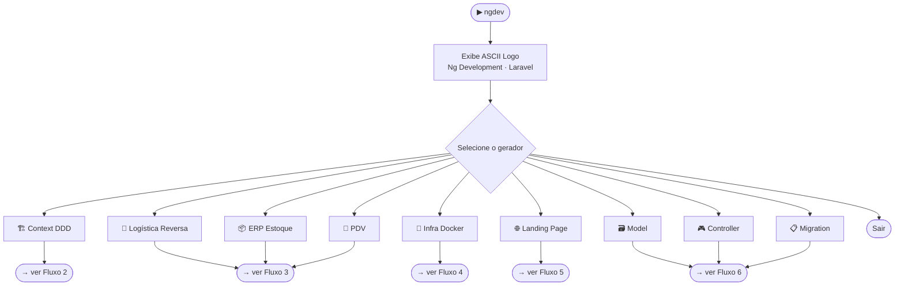
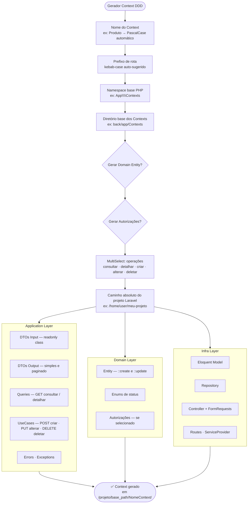
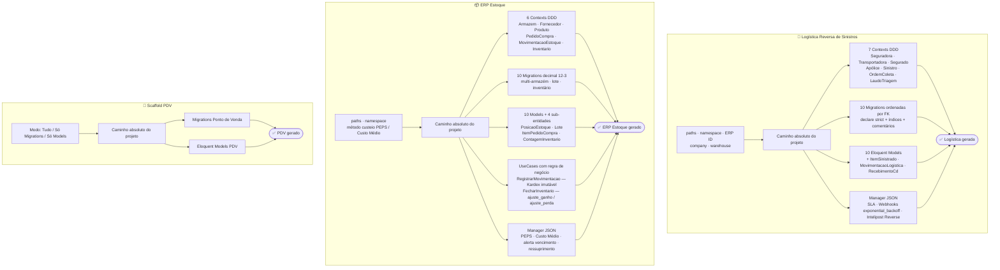
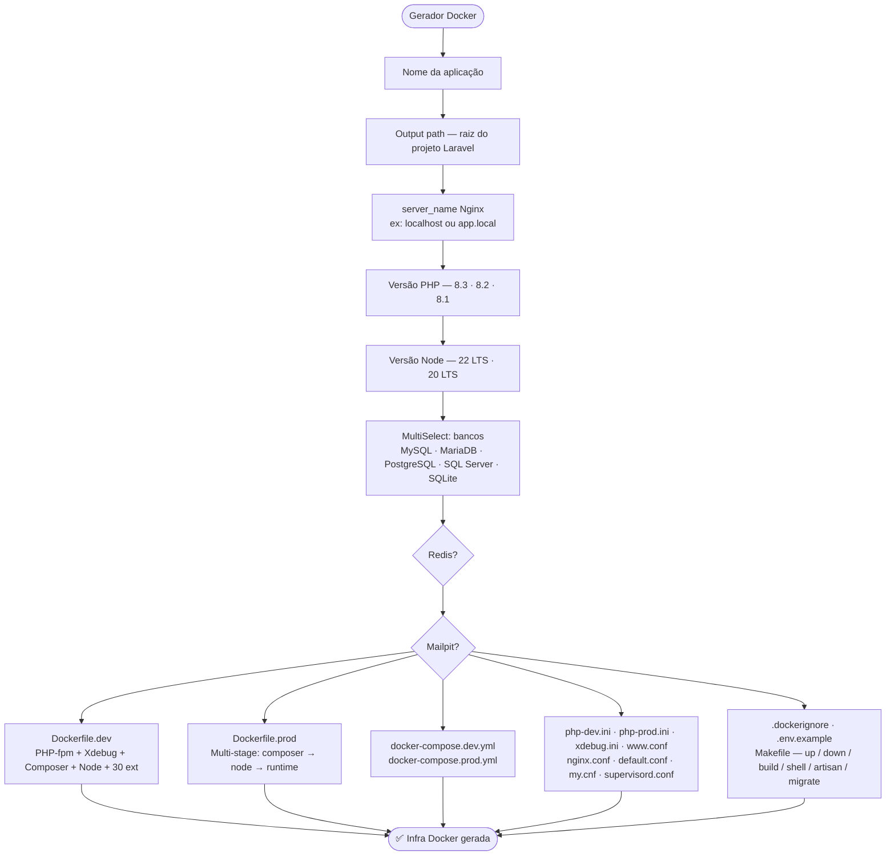
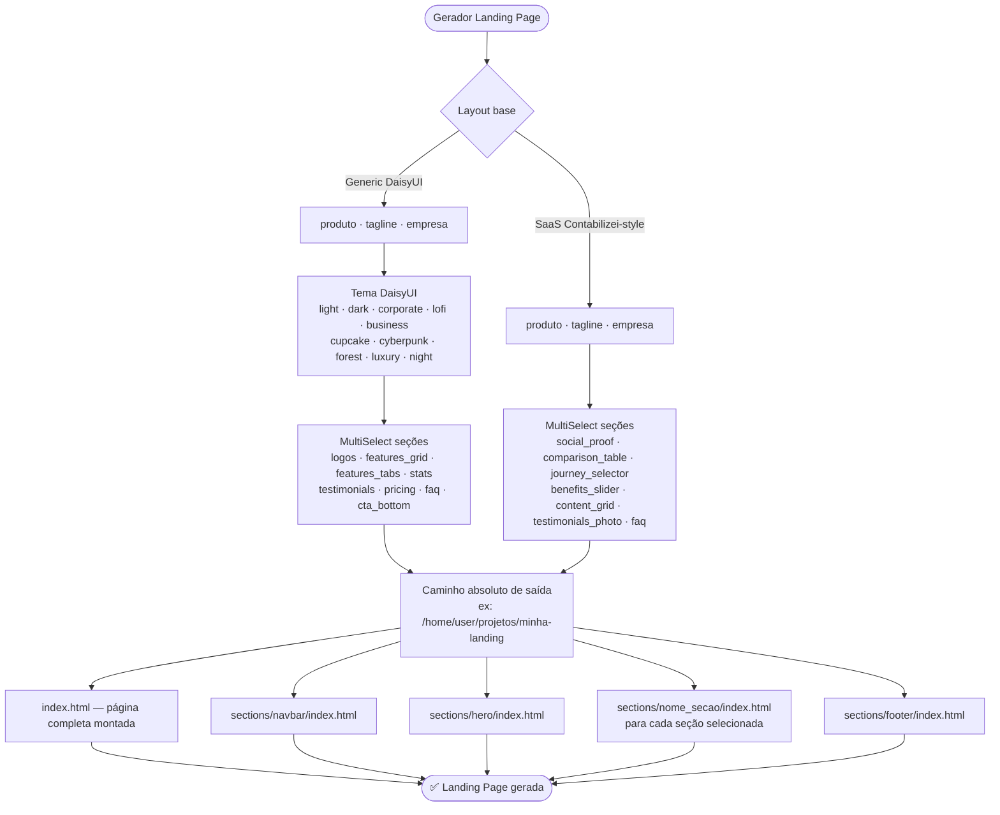

# ngdev-laravel

> **Gerador interativo de código Laravel com suporte a DDD, Clean Architecture e infraestrutura Docker.**  
> Escrito em Rust — roda via terminal e via painel gráfico (Tauri). Sem dependências externas.

```
##########################################################################
##########################################################################
##########################################################################
#################################################################****#####
###############################################################*=:..:+*###
##############################################################*-.    .+###
##############################################################*:      -###
##############################################################*-     .+###
##############################################################*: ...:=####
#####################*****###**+++**##############**+++***###*: -***######
####################=.....+*=:.    .-+*########*+-.     .-+*+:.-##########
##############*=-*##=     -.         .=#######+:          .:..=#+#########
############*=. :*##+                  =#####=.       ..    .=#-.*########
##########*-.   :*##+       :=++-.     .*###=     .-+***+:..+*- .*########
########+-.   .=*###+      =#%%%%*:    .+##*.    .+#%%%%%#=+*-  .*########
######+:    :=#%####+     :#####%%=     =##+.    =#%###%%%#*:   .*########
#####+.. .:+#%######+     -#######+     =##=    .*#########+    .*########
#####+...:*#########+.   .=#######+     =##=.   .*#########=    .*########
#####*:....-+#######+.  ..-#######+.    =##+.   .+#########:.   .*########
#######+:....:=*####+.....=#######+.....=###: ..=*+*#####*-......*########
######%%#*-....:=###+.....=#######+.....=##%+..+*-.:-=+=-.......:*########
########%%#*=...:###+.....=#######+.....=##%%+**-...............:*########
##########%%%#=::###+.....=#######+.....=#####*:..........--....:*########
###########%%%%#*###+.....=#######+.....=####*:.-+-:::::=*#=....:*########
##############%%%###*=----+#######*--=--*###+:.=#%######%##:....:#%%###%##
####################%%%%%%%######%%%%%#####+::=#*###%#####=:..:.=#%%%%%%%%
#####################%%%%%########%#######=.:+*-:-=+****+-:.::::#%%%%%%%%%
#####################################*=-:-::+#-::::::::::::::::*%%%%%%%%%%
####################################+::::::-#*-::::::::::::::-*%%%#%#%####
####################################-:::::::*##*+=-:::::::-+*%%%%%#%%%####
####################################=:::::::*%%%%%########%%%%%%%%#%%%####
####################################*-:::::+#%%%%%%%%%%%%%%%%%%%%%#%%%####
###################################%%#*+=+*#%%##%%%%%%%%%%%%%%%%%%%%%%####
###################################%%%%%%%%#######%%%%%%%%%#%%%%%%#%%%=###
####################################%%%%%%%%###%%%%%%###%%%#%%%%%%##%%+###
#####################################%%##%#####%##%%#%%#%%###%%##%#%%%%%%%
#########################################%####%%%%%%%%%%%%%%%%%%%%%%%%%%%%
########################################%%##########%%%%%%%%%%%#%%#%%%%%%%
######################################%%#######%#%#%%#%%%%%%%%%%%%%%%%%%%%
#######################################%%%%#%#%%%%%%%%%####%%%%%%%%%%%%%%%
#############%%%###################%##%%%%##%#%%%%%%%%%###%%#%%%%%%%%%#%%%
```
---

## Sumário

- [Visão Geral](#visão-geral)
- [Estrutura do Projeto](#estrutura-do-projeto)
- [Fluxo 1 — Menu Principal](#fluxo-1--menu-principal)
- [Fluxo 2 — Context DDD](#fluxo-2--context-ddd)
- [Fluxo 3 — Scaffolds Completos](#fluxo-3--scaffolds-completos-logística--estoque--pdv)
- [Fluxo 4 — Infra Docker](#fluxo-4--infra-docker)
- [Fluxo 5 — Landing Page](#fluxo-5--landing-page)
- [Fluxo 6 — Geradores Avulsos](#fluxo-6--geradores-avulsos)
- [Geradores em Detalhe](#geradores-em-detalhe)
- [Painel Gráfico — ngdev Manager](#painel-gráfico--ngdev-manager-tauri)
- [Instalação](#instalação-e-uso)
- [Licença](#licença)

---

## Visão Geral

O `ngdev` gera scaffolding completo para projetos Laravel com DDD e Clean Architecture. Cada gerador faz perguntas interativas e salva os arquivos no **caminho absoluto informado pelo usuário** — nunca dentro do próprio projeto `ngdev`.

| Modo | Como rodar |
|---|---|
| **CLI interativo** | `ngdev` no terminal |
| **Painel desktop** | `tauri dev` (dev) ou binário `ngdev-manager` (prod) |

**9 geradores disponíveis:**

| # | Gerador | O que entrega |
|---|---|---|
| 1 | Context DDD | Bounded context completo (Application + Domain + Infra) |
| 2 | Logística Reversa | 7 Contexts + 10 Migrations + 10 Models + Manager JSON |
| 3 | ERP Estoque | 6 Contexts + Kardex + UseCases + Manager JSON |
| 4 | Infra Docker | Dockerfile dev/prod + compose + Nginx + Makefile |
| 5 | Landing Page | HTML + Tailwind + DaisyUI (generic) ou Contabilizei-style (SaaS) |
| 6 | Model | Eloquent + Migration + Controller opcionais |
| 7 | Controller | Plain ou Resource com Model |
| 8 | Migration | Schema::create com strict_types |
| 9 | PDV | Scaffold completo Ponto de Venda |

---

## Estrutura do Projeto

```
ngdev-laravel/
├── src/
│   ├── main.rs                  ← CLI: menu interativo + ASCII logo
│   ├── cli.rs                   ← Structs de args compartilhados
│   └── flows/
│       ├── context/             ← Gerador Context DDD
│       ├── docker/              ← Gerador Infra Docker
│       ├── estoque/             ← Scaffold ERP Estoque
│       ├── landing_page/        ← Gerador Landing Page (generic + saas)
│       │   ├── templates.rs     ← Layout DaisyUI generic
│       │   └── templates_saas.rs← Layout Contabilizei-style
│       ├── logistica_reversa/   ← Scaffold Logística Reversa
│       ├── pdv/                 ← Scaffold PDV
│       └── artesanal/
│           ├── controller/      ← Gerador Controller
│           ├── model/           ← Gerador Model
│           └── migration/       ← Gerador Migration
├── manager/                     ← Crate Tauri (painel desktop)
│   ├── src/
│   │   ├── lib.rs               ← Tauri app builder
│   │   └── commands.rs          ← Bridge frontend → geradores Rust
│   └── tauri.conf.json
├── frontend-installer/          ← SPA Vite + TypeScript + Tailwind + DaisyUI
│   ├── index.html               ← Layout drawer (sidebar + main)
│   └── src/main.ts              ← Páginas e handlers dos 9 geradores
├── Cargo.toml                   ← Workspace (ngdev-laravel + manager)
└── install.sh                   ← Instala ngdev em /usr/local/bin
```

---

## Fluxo 1 — Menu Principal



---

## Fluxo 2 — Context DDD



---

## Fluxo 3 — Scaffolds Completos (Logística · Estoque · PDV)



---

## Fluxo 4 — Infra Docker



---

## Fluxo 5 — Landing Page



---

## Fluxo 6 — Geradores Avulsos

```mermaid
flowchart TD
    subgraph MOD [🗃 Model]
        M1[Nome — ex: Produto] --> M2{+ Migration?}
        M2 --> M3{+ Controller?}
        M3 --> M4[Caminho absoluto do projeto]
        M4 --> MA[app/Models/Produto.php\nfillable · hidden · table]
        M4 --> MB[database/migrations/..._create_produtos_table.php]
        M4 --> MC[app/Http/Controllers/ProdutoController.php]
        MA & MB & MC --> MOK([✅ Model gerado])
    end

    subgraph CTRL [🎮 Controller]
        C1[Nome — ex: ProdutoController] --> C2{Resource Controller?}
        C2 --> C3[Model opcional — type-hint automático]
        C3 --> C4[Caminho absoluto do projeto]
        C4 --> CA[app/Http/Controllers/ProdutoController.php\nindex · create · store · show · edit · update · destroy]
        CA --> COK([✅ Controller gerado])
    end

    subgraph MIG [📋 Migration]
        G1[Nome — ex: create_produtos_table] --> G2[Table opcional\nauto-inferida do nome]
        G2 --> G3[Caminho absoluto do projeto]
        G3 --> GA[database/migrations/YYYY_MM_DD_HHMMSS_nome.php\ndeclare strict + Schema::create + timestamps]
        GA --> GOK([✅ Migration gerada])
    end
```



---

## Geradores em Detalhe

### 🏗️ Context DDD

| Camada | O que gera |
|---|---|
| **Application** | DTOs Input (`readonly class`) · DTOs Output (simples e paginado) · Queries (GET) · UseCases (POST/PUT/DELETE) · Errors · Exceptions |
| **Domain** | Entity (com `::create()` / `::update()`) · Enums · Autorizações |
| **Infra** | Eloquent Model · Repository · Controller · FormRequests · Routes · ServiceProvider |

---

### 🚚 Logística Reversa de Sinistros

- **7 Contexts DDD** — Seguradora, Transportadora, Segurado, Apólice, Sinistro, OrdemColeta, LaudoTriagem
- **3 sub-entidades** — ItemSinistrado, MovimentacaoLogistica, RecebimentoCd
- **10 Migrations** em ordem de FK com `declare(strict_types=1)`, índices e comentários
- **10 Eloquent Models** com relacionamentos cross-context via FQN
- **Manager JSON** — SLA, webhooks com `exponential_backoff`, Intelipost Reverse

---

### 📦 ERP de Estoque

- **6 Contexts DDD** — Armazem, Fornecedor, Produto, PedidoCompra, MovimentacaoEstoque *(Kardex imutável — sem PUT/DELETE)*, Inventario
- **4 sub-entidades** — PosicaoEstoque, Lote, ItemPedidoCompra, ContagemInventario
- **UseCases especiais:**
  - `RegistrarMovimentacaoUseCase` — calcula `saldo_apos_movimento`, bloqueia estoque negativo
  - `FecharInventarioUseCase` — gera ajustes `ajuste_ganho`/`ajuste_perda` no Kardex automaticamente
- **10 Migrations** com `decimal(12,3)` para suporte a KG/Litros
- **Manager JSON** — PEPS / Custo Médio, alerta de vencimento, ressuprimento automático

---

### 🐳 Infra Docker (DEV + PROD)

| Arquivo | Descrição |
|---|---|
| `Dockerfile.dev` | PHP 8.3-fpm, +30 extensões, Xdebug, Composer, Node.js |
| `Dockerfile.prod` | Multi-stage: composer-deps → node-assets → runtime otimizado |
| `docker-compose.dev.yml` | App + Nginx + DBs + Redis + Mailpit com healthchecks |
| `docker-compose.prod.yml` | App + Horizon worker, sem devtools |
| `docker/php/php-dev.ini` | Erros visíveis, OPcache desligado |
| `docker/php/php-prod.ini` | OPcache agressivo + JIT tracing |
| `docker/php/xdebug.ini` | Modo develop/debug/coverage, porta 9003 |
| `docker/php/www.conf` | PHP-FPM pool: pm=dynamic, max_children=50 |
| `docker/nginx/nginx.conf` | Worker config, gzip, headers de segurança |
| `docker/nginx/default.conf` | Server block Laravel com healthcheck |
| `docker/mysql/my.cnf` | utf8mb4, InnoDB tuning, slow query log |
| `docker/supervisor/supervisord.prod.conf` | Nginx + PHP-FPM + 2 queue workers |
| `.dockerignore` | Exclui vendor, node_modules, .env, tests |
| `.env.example` | Pré-configurado com os serviços selecionados |
| `Makefile` | `make up/down/build/shell/artisan/migrate/test/prod-*` |

**Bancos suportados:** MySQL 8.4 · MariaDB 11.4 · PostgreSQL 17 · SQL Server 2022 · SQLite

---

### 🌐 Landing Page

Dois layouts disponíveis — cada seção em **diretório próprio**:

**Generic (DaisyUI)** — 10 temas:
`logos` · `features_grid` · `features_tabs` · `stats` · `testimonials` · `pricing` · `faq` · `cta_bottom`

**SaaS (Contabilizei-style)** — fundo branco, verde:
`social_proof` · `comparison_table` · `journey_selector` · `benefits_slider` · `content_grid` · `testimonials_photo` · `faq`

Estrutura de saída:
```
minha-landing/
  index.html
  sections/
    navbar/index.html
    hero/index.html
    features_grid/index.html
    pricing/index.html
    footer/index.html
    ...
```

---

## Painel Gráfico — ngdev Manager (Tauri)

Interface desktop construída com **Tauri v2 + Vite + TypeScript + Tailwind CSS + DaisyUI**.

```
manager/              ← crate Rust (Tauri backend)
frontend-installer/   ← SPA com 9 telas, uma por gerador
```

Para rodar em modo de desenvolvimento:

```bash
cd manager
tauri dev
# O Vite frontend inicia automaticamente em http://localhost:1420
```

Para build de produção:

```bash
cd manager
tauri build
```

---

## Instalação e Uso

### CLI

```bash
# Compilar e instalar globalmente em /usr/local/bin
./install.sh --build

# Executar
ngdev

# Ou sem instalar
cargo run
```

### Desinstalar

```bash
./install.sh --uninstall
```

### Compilar binário estático (musl)

```bash
rustup target add x86_64-unknown-linux-musl
RUSTFLAGS="-C target-feature=+crt-static" \
  cargo build --release --target x86_64-unknown-linux-musl
```

---

## Licença

```
MIT License — Copyright (c) 2026 Ng Development
```
