##########################################################################
##########################################################################
##########################################################################
#################################################################****#####
###############################################################*=:..:+*###
##############################################################*-.    .+###
##############################################################*:      -###
##############################################################*-     .+###
##############################################################*: ...:=####
#####################*****###**+++**##############**+++***###*: -***######
####################=.....+*=:.    .-+*########*+-.     .-+*+:.-##########
##############*=-*##=     -.         .=#######+:          .:..=#+#########
############*=. :*##+                  =#####=.       ..    .=#-.*########
##########*-.   :*##+       :=++-.     .*###=     .-+***+:..+*- .*########
########+-.   .=*###+      =#%%%%*:    .+##*.    .+#%%%%%#=+*-  .*########
######+:    :=#%####+     :#####%%=     =##+.    =#%###%%%#*:   .*########
#####+.. .:+#%######+     -#######+     =##=    .*#########+    .*########
#####+...:*#########+.   .=#######+     =##=.   .*#########=    .*########
#####*:....-+#######+.  ..-#######+.    =##+.   .+#########:.   .*########
#######+:....:=*####+.....=#######+.....=###: ..=*+*#####*-......*########
######%%#*-....:=###+.....=#######+.....=##%+..+*-.:-=+=-.......:*########
########%%#*=...:###+.....=#######+.....=##%%+**-...............:*########
##########%%%#=::###+.....=#######+.....=#####*:..........--....:*########
###########%%%%#*###+.....=#######+.....=####*:.-+-:::::=*#=....:*########
##############%%%###*=----+#######*--=--*###+:.=#%######%##:....:#%%###%##
####################%%%%%%%######%%%%%#####+::=#*###%#####=:..:.=#%%%%%%%%
#####################%%%%%########%#######=.:+*-:-=+****+-:.::::#%%%%%%%%%
#####################################*=-:-::+#-::::::::::::::::*%%%%%%%%%%
####################################+::::::-#*-::::::::::::::-*%%%#%#%####
####################################-:::::::*##*+=-:::::::-+*%%%%%#%%%####
####################################=:::::::*%%%%%########%%%%%%%%#%%%####
####################################*-:::::+#%%%%%%%%%%%%%%%%%%%%%#%%%####
###################################%%#*+=+*#%%##%%%%%%%%%%%%%%%%%%%%%%####
###################################%%%%%%%%#######%%%%%%%%%#%%%%%%#%%%=###
####################################%%%%%%%%###%%%%%%###%%%#%%%%%%##%%+###
#####################################%%##%#####%##%%#%%#%%###%%##%#%%%%%%%
#########################################%####%%%%%%%%%%%%%%%%%%%%%%%%%%%%
########################################%%##########%%%%%%%%%%%#%%#%%%%%%%
######################################%%#######%#%#%%#%%%%%%%%%%%%%%%%%%%%
#######################################%%%%#%#%%%%%%%%%####%%%%%%%%%%%%%%%
#############%%%###################%##%%%%##%#%%%%%%%%%###%%#%%%%%%%%%#%%%


                    ╔══════════════════════════════════════╗
                    ║                                      ║
                    ║           Ng Development             ║
                    ║              Laravel                 ║
                    ║          context creator             ║
                    ║                                      ║
                    ╚══════════════════════════════════════╝

---

# ngdev-laravel

> **Gerador interativo de código Laravel com suporte a DDD, Clean Architecture e infraestrutura Docker.**
> Escrito em Rust — roda via terminal, sem dependências externas.

---

## Fluxograma

```mermaid
flowchart TD
    START([▶ ngdev]) --> LOGO[Exibe Logo ASCII\ne Menu Interativo]

    LOGO --> MENU{O que gerar?}

    MENU --> A[Criar Context DDD]
    MENU --> B[Scaffold Logística Reversa]
    MENU --> C[Scaffold ERP Estoque]
    MENU --> D[Gerar Infra Docker]
    MENU --> E[Criar Model]
    MENU --> F[Criar Controller]
    MENU --> G[Criar Migration]
    MENU --> H[Scaffold PDV]
    MENU --> EXIT([Sair])

    %% ── Context DDD ──────────────────────────────────────────────────────────
    A --> A1[Wizard: nome, prefixo,\nnamespace, operações]
    A1 --> A2[Application Layer\nDTOs · Queries · UseCases\nErrors · Exceptions]
    A1 --> A3[Domain Layer\nEntities · Enums\nAutorizações]
    A1 --> A4[Infra Layer\nModels · Repositories\nController · Requests\nRoutes · ServiceProvider]
    A2 & A3 & A4 --> A5[✅ Context gerado]

    %% ── Logística Reversa ────────────────────────────────────────────────────
    B --> B1[Wizard: paths,\nnamespace, ERP ID]
    B1 --> B2[7 Contexts DDD\nSeguradora · Transportadora\nSegurado · Apólice\nSinistro · OrdemColeta\nLaudoTriagem]
    B1 --> B3[10 Migrations\nordenadas por FK]
    B1 --> B4[10 Eloquent Models\n+ 3 sub-entidades]
    B1 --> B5[Manager JSON\nSLA · Webhooks · Carriers]
    B2 & B3 & B4 & B5 --> B6[✅ Logística Reversa gerada]

    %% ── ERP Estoque ──────────────────────────────────────────────────────────
    C --> C1[Wizard: paths,\nnamespace, método custeio]
    C1 --> C2[6 Contexts DDD\nArmazem · Fornecedor\nProduto · PedidoCompra\nMovimentacaoEstoque\nInventario]
    C1 --> C3[10 Migrations\nordm decimal 12,3]
    C1 --> C4[10 Models + 4 sub-entidades\nPosicaoEstoque · Lote\nItemPedidoCompra\nContagemInventario]
    C1 --> C5[UseCases especiais\nKardex saldo_apos_movimento\nFecharInventario c/ ajustes]
    C1 --> C6[Manager JSON\nSLA · PEPS · Ressuprimento]
    C2 & C3 & C4 & C5 & C6 --> C7[✅ ERP Estoque gerado]

    %% ── Docker ───────────────────────────────────────────────────────────────
    D --> D1[Wizard: PHP · Node\nBancos · Redis · Mailpit]
    D1 --> D2[Dockerfile.dev\nPHP 8.3-fpm · Xdebug\nComposer · Node.js\n+30 extensões PHP]
    D1 --> D3[Dockerfile.prod\nMulti-stage build\nComposer → Node → Runtime]
    D1 --> D4[docker-compose\ndev + prod\nMySQL · MariaDB · PostgreSQL\nSQL Server · Redis · Mailpit]
    D1 --> D5[Nginx · PHP-FPM · Supervisor\nXdebug ini · OPcache JIT\n.env.example · Makefile]
    D2 & D3 & D4 & D5 --> D6[✅ Infra Docker gerada]

    %% ── Outros ───────────────────────────────────────────────────────────────
    E --> E1[Model Eloquent\n+ Migration opcional\n+ Controller opcional]
    F --> F1[Controller plain\nou Resource com Model]
    G --> G1[Migration com\nSchema::create]
    H --> H1[Scaffold PDV\nMigrations + Models\nPonto de Venda]

    E1 & F1 & G1 & H1 --> DONE([✅ Arquivo gerado])
```



---

## O que o ngdev-laravel fornece

### 🏗️ Gerador de Context DDD
Cria a estrutura completa de um bounded context seguindo **DDD + Clean Architecture**:

| Camada | O que gera |
|---|---|
| **Application** | DTOs Input (`readonly class`) · DTOs Output (simples e paginado) · Queries (GET) · UseCases (POST/PUT/DELETE) · Errors · Exceptions |
| **Domain** | Entity (com `::create()` / `::update()`) · Enums · Autorizações |
| **Infra** | Eloquent Model · Repository · Controller · FormRequests · Routes · ServiceProvider |

Opções interativas: escolha de operações (consultar/detalhar/criar/alterar/deletar), namespace base, prefixo de rota, geração de Entity e Autorizações.

---

### 🚚 Scaffold — Logística Reversa de Sinistros
Gera em uma única execução o sistema completo de logística reversa para sinistros de seguros:

- **7 Contexts DDD** — Seguradora, Transportadora, Segurado, Apólice, Sinistro, OrdemColeta, LaudoTriagem
- **3 sub-entidades** — ItemSinistrado, MovimentacaoLogistica, RecebimentoCd
- **10 Migrations** em ordem de FK com `declare(strict_types=1)`, índices e comentários
- **10 Eloquent Models** com relacionamentos cross-context via FQN
- **Manager JSON** — SLA, webhooks com `exponential_backoff`, Intelipost Reverse

---

### 📦 Scaffold — ERP de Estoque
Gera o núcleo de um ERP de gestão de estoque multi-armazém:

- **6 Contexts DDD** — Armazem, Fornecedor, Produto, PedidoCompra, MovimentacaoEstoque *(Kardex imutável, sem PUT/DELETE)*, Inventario
- **4 sub-entidades** — PosicaoEstoque, Lote, ItemPedidoCompra, ContagemInventario
- **UseCases especiais com regra de negócio real:**
  - `RegistrarMovimentacaoUseCase` — calcula `saldo_apos_movimento`, bloqueia estoque negativo
  - `FecharInventarioUseCase` — gera ajustes `ajuste_ganho`/`ajuste_perda` no Kardex automaticamente
- **10 Migrations** com `decimal(12,3)` para suporte a KG/Litros
- **Manager JSON** — PEPS / Custo Médio, alerta de vencimento, ressuprimento automático

---

### 🐳 Infra Docker (DEV + PROD)
Gera toda a infraestrutura containerizada:

| Arquivo | Descrição |
|---|---|
| `Dockerfile.dev` | PHP 8.3-fpm, +30 extensões, Xdebug, Composer, Node.js |
| `Dockerfile.prod` | Multi-stage: composer-deps → node-assets → runtime otimizado |
| `docker-compose.dev.yml` | App + Nginx + DBs + Redis + Mailpit com healthchecks |
| `docker-compose.prod.yml` | App + Horizon worker, sem devtools |
| `docker/php/php-dev.ini` | Erros visíveis, OPcache desligado |
| `docker/php/php-prod.ini` | OPcache agressivo + JIT tracing |
| `docker/php/xdebug.ini` | Modo develop/debug/coverage, porta 9003 |
| `docker/php/www.conf` | PHP-FPM pool: pm=dynamic, max_children=50 |
| `docker/nginx/nginx.conf` | Worker config, gzip, headers de segurança |
| `docker/nginx/default.conf` | Server block Laravel com healthcheck |
| `docker/mysql/my.cnf` | utf8mb4, InnoDB tuning, slow query log |
| `docker/supervisor/supervisord.prod.conf` | Nginx + PHP-FPM + 2 queue workers |
| `.dockerignore` | Exclui vendor, node_modules, .env, tests |
| `.env.example` | Pré-configurado com os serviços selecionados |
| `Makefile` | `make up/down/build/shell/artisan/migrate/test/prod-*` |

**Bancos suportados:** MySQL 8.4 · MariaDB 11.4 · PostgreSQL 17 · SQL Server 2022 · SQLite

---

### 🗂️ Geradores Avulsos
- **Model** — Eloquent com `$fillable`, `$hidden`, `$table`, opção de gerar Migration e Controller juntos
- **Controller** — plain ou resource com type-hint do Model
- **Migration** — `Schema::create` com `declare(strict_types=1)`
- **PDV Scaffold** — conjunto completo de migrations e models para Ponto de Venda

---

## Instalação e uso

```bash
# Compilar
cargo build --release

# Executar
./target/release/ngdev

# Ou direto pelo cargo
cargo run
```

---

## Licença

```
MIT License

Copyright (c) 2026 Ng Development

Permission is hereby granted, free of charge, to any person obtaining a copy
of this software and associated documentation files (the "Software"), to deal
in the Software without restriction, including without limitation the rights
to use, copy, modify, merge, publish, distribute, sublicense, and/or sell
copies of the Software, and to permit persons to whom the Software is
furnished to do so, subject to the following conditions:

The above copyright notice and this permission notice shall be included in all
copies or substantial portions of the Software.

THE SOFTWARE IS PROVIDED "AS IS", WITHOUT WARRANTY OF ANY KIND, EXPRESS OR
IMPLIED, INCLUDING BUT NOT LIMITED TO THE WARRANTIES OF MERCHANTABILITY,
FITNESS FOR A PARTICULAR PURPOSE AND NONINFRINGEMENT. IN NO EVENT SHALL THE
AUTHORS OR COPYRIGHT HOLDERS BE LIABLE FOR ANY CLAIM, DAMAGES OR OTHER
LIABILITY, WHETHER IN AN ACTION OF CONTRACT, TORT OR OTHERWISE, ARISING FROM,
OUT OF OR IN CONNECTION WITH THE SOFTWARE OR THE USE OR OTHER DEALINGS IN THE
SOFTWARE.
```